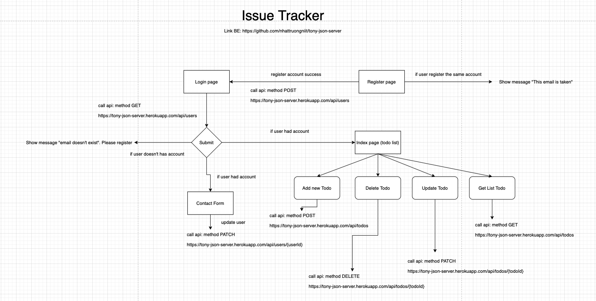
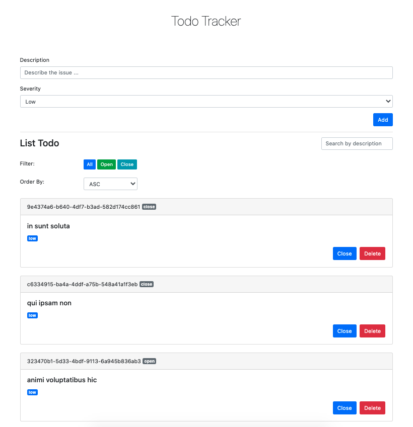
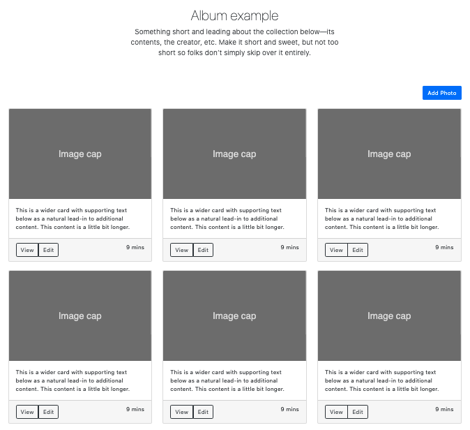

# Build Apps with Pure Javascript

## Track

- pure javascript
- bootstrap v4

## Api

use api: https://github.com/nhattruongniit/tony-json-server

# Build an Issue Tracker Apps

## Flow diagram

## UI

todo-tracker/index.html

## Tasks

- Add new Todo
- Delete Todo
- Update Todo
- Filter Todo
- Search by description
- Order by ASC or DESC

# Build an Photo Album Apps

## UI

photo-album/index.html

## Tasks

- Add new Photo: photo-album/add.html
- Show List Photo
- Pagination Photo
- Edit Photo
- View Detail Photo: photo-album/detail.html
